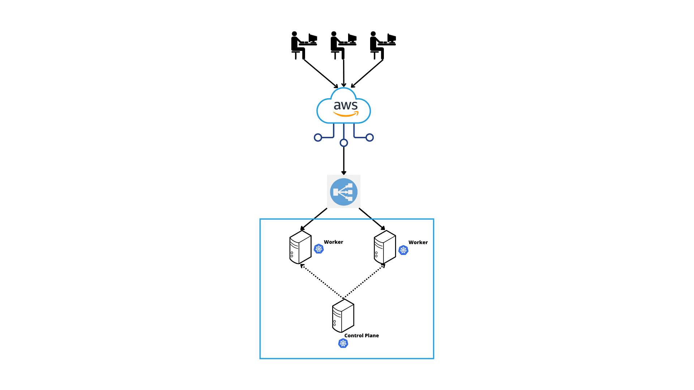

# Provisionamento e Operação de Infraestrutura

## Objetivos do projeto
* Provisionar um cluster Kubernetes na AWS
* Rodar uma aplicação em Kubernetes no cluster
* Observar que, conforme o consumo de recursos varia, o control plane aumenta ou diminui o número de pods no cluster
* Monitorar essas métricas via Prometheus

## Pré-requisitos
* Uma conta na AWS com uma chave de acesso e a CLI [instalada](https://docs.aws.amazon.com/cli/latest/userguide/getting-started-prereqs.html) e [configurada](https://docs.aws.amazon.com/cli/latest/userguide/cli-chap-configure.html)
* [Terraform](https://developer.hashicorp.com/terraform/tutorials/aws-get-started/install-cli)
* [Ansible](https://docs.ansible.com/ansible/latest/installation_guide/intro_installation.html)

## Arquitetura
* **Cluster Kubernetes:** 1 nó Control Plane e 2 nós Workers
* **Prometheus:** Presente no nó do Control Plane
* **Load Balancer:** Redireciona o tráfego para os nós Workers



## Provisionamento

1. Inicializar o terraform:
```bash
$ cd terraform && terraform init
```

2. Criar, se não tiver, uma chave RSA:
```bash
$ ssh-keygen -t rsa -b 2048 -f ~/.ssh/id_rsa
```

3. Provisionar e configurar a infra:
```bash
$ ./provision.sh
```

4. Logar no control plane e adicionar a linha `hostNetwork: true` abaixo da linha `dnsPolicy` no deployment do metrics-server:
```bash
$ kubectl edit -n kube-system deployments metrics-server
```

### Terraform
Responsável por provisionar os seguintes recursos na AWS:
* 1 template de instância (Ubuntu 20.04, t2.medium)
* 3 instâncias EC2 a partir do template (1 CP e 2 Workers)
* 1 chave pública para conseguir acesso às instâncias
* 1 Network Load Balancer para redirecionar o tráfego para os Workers
* 1 VPC e 1 sub-rede pública
* 1 Elastic IP para ser anexado à sub-rede das instâncias
* 1 Security Group (Firewall) regulando o tráfego de entrada nas instâncias

### Ansible
Ferramenta de configuração remota responsável por:
* Instalar e configurar o Kubernetes em todos os nós do cluster
* Inicializar o cluster no _Control Plane_
* Conectar os _Workers_ ao _Control Plane_
* Instalar e configurar o Prometheus no _Control Plane_

### Kubernetes
Ferramenta de orquestração de containers em ambientes de alta disponibilidade. Os objetos Kubernetes provisionados foram:
* 1 _Deployment_
* 1 _Service_ do tipo **NodePort**
* 1 _Horizontal Pod Autoscaler_

## Uso
* Rota health:
```bash
$ curl http://<<load balancer ip>>/health
```

* Para estressar a CPU:
```bash
$ curl http://<<load balancer ip>>/cpu
```

* Para estressar a memória:
```bash
$ curl http://<<load balancer ip>>/memory
```
```

* Dashboard do Prometheus:
```bash
$ curl http://<<control plane ip>>:9090
```
